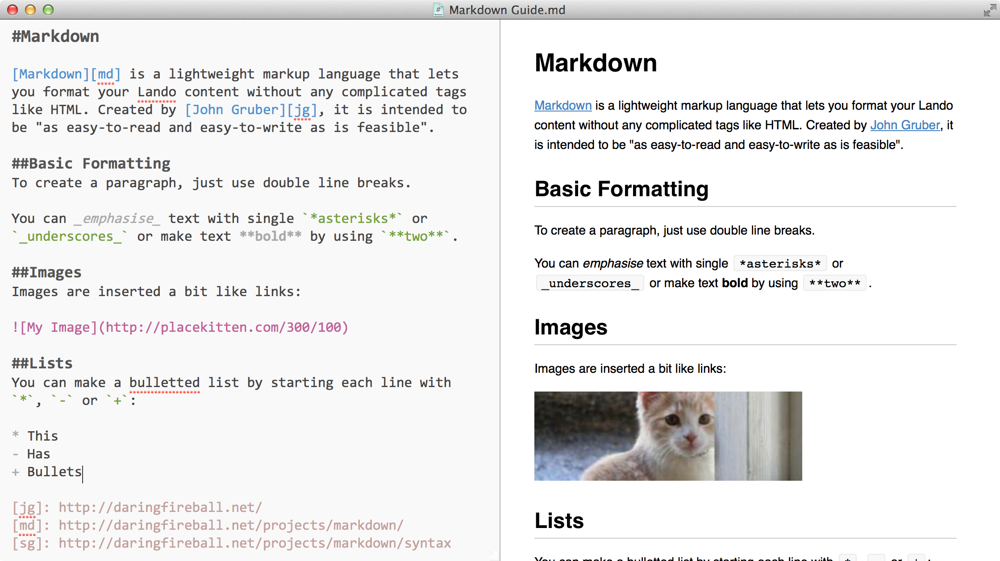

#Mou Theme

A clean, colourful theme for the Mac Markdown editor [Mou](http://mouapp.com/).

To install, copy `Sam Rayner+.txt` to
```
~/Library/Application Support/Mou/Themes
```

Here, demonstrated with 16pt Consolas and the GitHub style preview:

